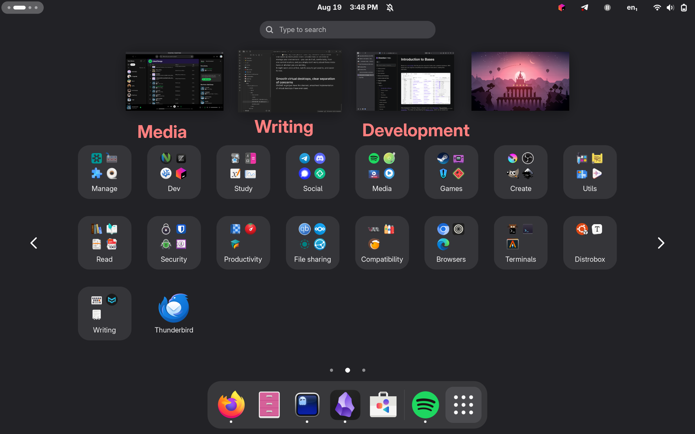

+++
title = "In defense of GNOME"
date = 2025-08-19
+++

I have been a Linux user for quite a while now - I have been running Linux as my primary operating system from 2018 up to now. I have done my time tinkering with my system and trying every distro and desktop environment after the sun... and, lo and behold, I have finally settled on Fedora with the GNOME desktop environment, which I have been using on my primary machine for the past 3+ years.

Hanging out in Linux-y spaces, one thing I have come across quite often is a pretty widespread hatred for GNOME, and everything around it.

In this post, I want to articulate why I choose GNOME as my desktop environment and why I love it, while providing an alternative perspective to many of the points of criticism I have heard about GNOME.

## What GNOME is, and what GNOME isn't

<small>An empty GNOME desktop</small>

Let's start off by defining what, in my opinion, GNOME represents and does not represent.

GNOME is an **opinionated, power-user-focused, keyboard-driven and workspace-driven** desktop environment.

Let's further drill into what each of these words implies:

- **Opinionated** => GNOME's philosophical approach is not to offer an endlessly customizable UI that allows one to meticulously craft their own experience about it. Rather, it seeks to offer a batteries-included environment, beautifully integrated and working from the first second onward, and that **has a specific vision** for its workflow that is different than just adhering to the de-facto standards that Windows and macOS largely abide.
- **Power-user-focused** => GNOME seems to be built exactly to meet the needs of power users: software engineers, platform engineers, system administrators, STEM students, academic researchers (...); all sets of users whose workflows revolve around massive amounts of reading and writing, and who tend to spend more time on their keyboards rather than their mice.
- **Keyboard-driven** => Every part of GNOME can be accessed via the keyboard, and the fastest, most efficient ways to use the DE are through keyboard shortcuts. However, it is also a good experience to use the desktop with a mouse, a touchpad or a touch screen.
- **Workspace-driven** => GNOME steals a page or two out of the tiling window manager playbook, by putting dynamic virtual desktops as one of the key concepts the workflow revolves around.

If this is not the desktop environment you want, you should probably look elsewhere. Trying to coerce GNOME into acting like another radically different desktop environment by overloading it with overly invasive shell extensions is not going to be a good experience.

Most criticism about GNOME that hinges on the fact that these principles are fundamentally wrong is *subjective preference*, rather than a matter of objective fact. There is no discussion that can be had on subjective preferences: you either like something, or you do not.

## Type away, and focus on your tasks
As I have already anticipated earlier, GNOME's workflow heavily relies on the keyboard.
Specifically, if you are already comfortable with a modal editor like `vim`, GNOME very much feels like a "modal desktop environment".
Fundamentally, at any given second, your shell can be in two states:
- **"Normal mode"** - The mode you will spend most of your time inside of, where you are actively using a program

    
    <small>The regular desktop view you spend most of your time in, working on something</small>

- **"Overview mode"** - Using GNOME's signature Overview to perform any kind of operation other than strictly using your programs: launching a new application, looking for a file, organizing your windows, etc.

    
    <small>GNOME's Overview, the one-stop shop for meta-operations</small>

You can access the overview by pressing the Super button, sliding three fingers upwards on your touchpad, or hitting the top left "hot corner" with your mouse.
From here, you are going to do all the meta-tasks about operating a desktop environment.
When you type anything, the system will react by immediately looking through your applications, commands, files, settings, contacts and browser tabs, with some level of semantic search, attempting to give you the most relevant options immediately.
The typical way to launch an application is to simply press Super, then type the first letter or two, press Enter and be off to the races.
In this view, you can also very quickly reorganize your virtual desktops, moving windows around logically as you see fit.
The gist here is that you are not meant to navigate long, nested menus with your mouse, or hit minuscule click targets on a taskbar that takes up more pixels than it should most of the time to manage your environment - you can do it all, comfortably, from one central location, and you simply don't worry about these meta-tasks at all when you are working.
It might seem alien at first, but it's easy to get used to, and easier to love.

## Smooth virtual desktops, clear separation of concerns
GNOME might just have the cleanest, smoothest implementation of virtual desktops I have ever used.

<small>Each virtual desktop is concerned with only one group of window, and one micro-task</small>

GNOME's virtual desktops act as a logical separation between different groups of windows and they are *dynamic*.
You start with just a couple virtual desktops when you start GNOME, and you may immediately start populating different desktops with different groups of windows.

Here's the killer app: **you don't have to worry** about creating, destroying or moving desktops around. All of that is done automatically for you.
The desktops are completely dynamic, - so much so that not only can you spawn a new window in the last desktop environment to add a group of windows, but you can even drag an open window between two virtual desktops, or the the left of the leftmost one, to create a new virtual desktop in any location you wish.

<video controls width="100%">
  <source src="./video/00-dynamic-desktops.mp4" type="video/mp4">
  Video of a window being dragged in between two virtual desktops to create a new one
</video>
<small>See how smooth it is!</small>

I find that, when I am using GNOME, *I actually use the virtual desktops*. On the contrary, when I am using other environments, like Windows, I find their implementation of virtual desktops so clunky and convoluted, I don't even bother.

Gone are the days of juggling between 10 windows at a time, organized in an overcrowded taskbar. No more "Alt + tab + tab + tab + tab... Oupsie, I missed the window, gotta do the entire lap again!". GNOME's workflow and abstractions give you a much saner way of handling windows.

<small>It doesn't have to be this way.</small>

## Low cognitive load, focus on the content

<small>Low cognitive load, the desktop stays out of your way and gives your work the spotlight</small>

A pattern that repeats across the entire GNOME experience is the fact that **the DE and its associated applications try very hard not to take up too much space in your head**. The user interfaces are optimized not to take up too much space, and to not overload your brain with information. The core functionality is going to be clearly exposed, with clear, big click targets - fast to spot, easy to click.
GNOME does not get in your way. It actively tries to stay out of your way, and give the spotlight to the actual thing you are working on.

As a bonus, I am heavily visually impaired, and the large click targets - combined with GNOME's attention to accessibility - work really well for me!

## On the criticism
Lastly, on to the spicy part: I am now going to attempt to address some of the criticism I currently encounter on GNOME.

### "GNOME is not customizable!"

<small>There are not too many cosmetic customizations available - and that's a good thing</small>

Not everything needs to be endlessly customizable as a design decision. This is a completely subjective point, and not an objective indicator of quality or lack thereof in a piece of software.

Furthermore, it can be argued that the *lack of* arbitrary customizability is a perfectly fine design decision on its own. As a GNOME contributor Tobias Bernard put it very well [in this blog post](https://blogs.gnome.org/tbernard/2021/07/13/community-power-4/), **every choice has a cost** - a cost you will pay handsomely.

The payoff of this *unorthodox* design decision, you can just feel as you use the DE. Everything is consistent, the defaults are great when you give them a chance, and it all flows like a dream.

As for me? I will take the polished, stable and batteries-included if  slightly inflexible desktop any day of the week. The priority is not customizing my laptop endlessly, the priority is actually completing the tasks I opened my laptop lid to complete, with the least amount of friction possible.

### "GNOME is not usable without tons of extensions, and extensions suck!"
The notion the desktop environment not being usable without extensions is fundamentally flawed, for several reasons.
The core GNOME experience contains a set of features that are well-tested, and that should do it for most users.
On the other hand, should the default feature set not quite do it for you, GNOME exposes a very powerful API for you, the [GNOME Extensions API](https://wiki.gnome.org/Projects(2f)GnomeShell(2f)Extensions.html), that allows you to write programs that modify the way the GNOME shell operates at runtime.
Writing and enabling a GNOME extension gives you an immense amount of power, as it is quite comparable in effect to compiling the desktop environment with a patch you made to fundamentally modify its behaviour - except these patches can be installed, enabled and disabled **hot**, online, and at runtime.

<small>GNOME extensions are good, actually; and completely optional</small>

A lot of people make the point that this concept is fundamentally flawed, but I respectfully disagree.
First and foremost, including every single feature under the sun inside the DE is a bad idea, because it creates too much maintenance overhead, and it will likely introduce unnecessary bugs, to maintain niche use cases that only a small part of the user base uses. It is simply **not realistic** unless you have nearly unlimited full-time manpower available to you at any given time. GNOME extensions allow the maintainers to focus on doing the core experience *well*, while, at the same time, allowing anyone to plug their own patch into the GNOME shell immediately, and having that feature working on their machines in any case, with no wait, even long before the process of upstreaming a MR into upstream is over.

Secondly, **GNOME extensions work well nowadays**. While not perfect and lacking guaranteed ABI-stability, the state of GNOME extensions has steadily improved now compared to the past, and further development experience improvements are on the way to extension developers.

Truthfully - needing to install one extension or three to apply some small tweak to your workspace is not a big issue and it will not make your computer crash or slow down nearly as much as plenty of people would say.

### GNOME doesn't want me to theme its apps!
One thing about the GNOME ecosystem in particular that I have seen people really take issue with is GNOME's controversially famous [Please don't theme our apps](https://stopthemingmy.app/) letter.

My counterpoint to most of the criticism about this topic is simple: *Read the actual letter*.

The "Please don't theme our apps" initiative is **not** directed at end users who seek to customize their working environment by loading custom stylesheets on GNOME applications, it is explicitly directed at Linux distributions that ship GNOME applications running in unsupported configurations, not taking responsibility for the breakage caused by shipping those applications in broken configurations, thus filling GNOME's bug trackers with issues and negative experiences users are having as a result of being served a misconfigured version of the GNOME application by their distro of choice, and tarnishing the reputation of GNOME technologies in the process.

If you actually take the time to read the letter, you will read:

> If you like to tinker with your own system, that’s fine with us. However, if you change things like stylesheets and icons, you should be aware that you’re in unsupported territory. Any issues you encounter should be reported to the theme developer, not the app developer.

Honestly, as a Software Engineer, I find this a completely sane and uncontroversial take. It is very common to ship a piece of software with the assumption that it will run in a certain environment, configured in a certain way, and to provide explicit support for that.

There is no interest in opposing individual themers and power users *just for the sake of it*: you may do what you want, but you are not entitled to explicit support for unsupported configurations. **Nothing** about this actually stops you from installing a GTK 3 or shell theme with GNOME Tweaks, or a `libadwaita` stylesheet with Gradience.

<small>Users may absolutely set a custom theme!</small>

## My own criticism and wishes
I love GNOME, but nothing is perfect.
I'll go straight to the point: **I wish GNOME had a tiling window mode** - specifically a per-desktop, on-demand tiling mode like the one that System76's Cosmic DE has. Keyboard-based tiling mode, even if completely optional, would fit GNOME's keyboard-driven workflow like a glove, and it would prove especially useful for development tasks.

The good news is, some work on this seems to be in the cards. Tobias Bernard [seems to have a pretty good conceptual idea](https://blogs.gnome.org/tbernard/2023/07/26/rethinking-window-management/) on how to implement this, so all that's left for me to do is to either wait, or find the courage to try and contribute towards this goal :p

## Wrapping up
GNOME is a great desktop environment. It is criminally underrated, and a lot of users tend to shy away from it. However, in reality, GNOME is not a toy, or a power-user-unfriendly desktop environment at all. Rather, it's a quality experience that you should give a real chance to.
